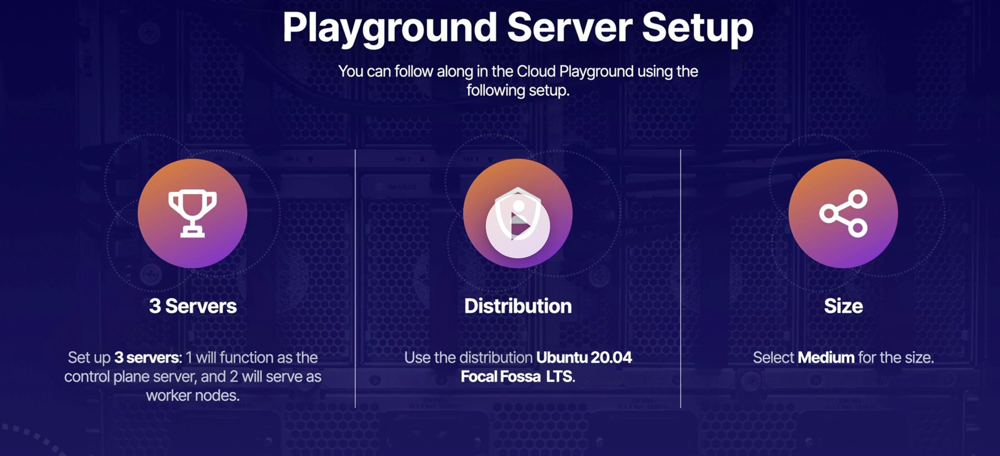
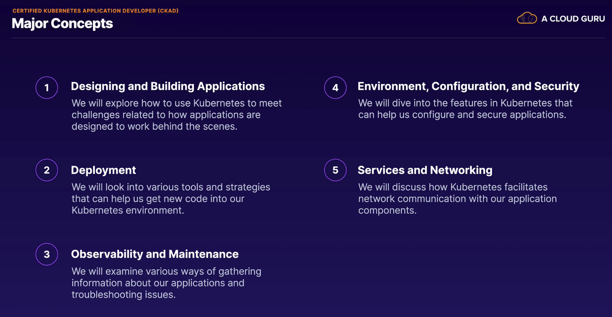
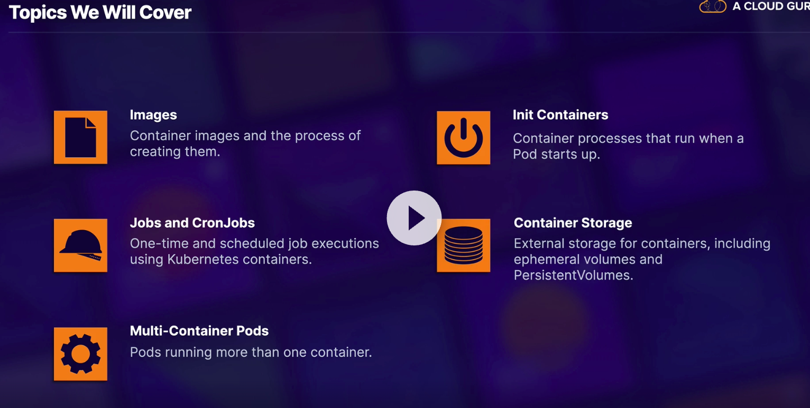
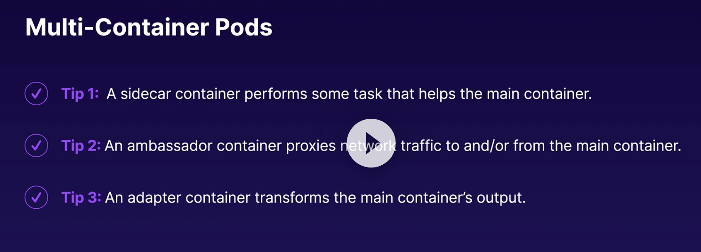
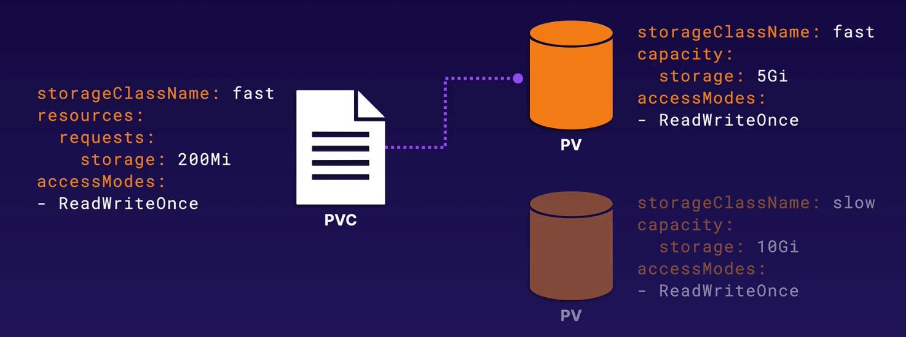

# Index
- [Index](#index)
- [Kubernetes Cluster Setup](#kubernetes-cluster-setup)
  - [Playground Setup](#playground-setup)
  - [Set host name on the servers](#set-host-name-on-the-servers)
  - [Update host file](#update-host-file)
  - [Install containerd in each node](#install-containerd-in-each-node)
  - [Install kubernetes packages on each node](#install-kubernetes-packages-on-each-node)
  - [Initialize the control plane (cluster)](#initialize-the-control-plane-cluster)
  - [Join the worker nodes to the cluster](#join-the-worker-nodes-to-the-cluster)
- [Major Concepts in CKAD](#major-concepts-in-ckad)
- [Application Design and Build](#application-design-and-build)
  - [Building Container Images](#building-container-images)
    - [Build image from Dockerfile](#build-image-from-dockerfile)
    - [Run the image](#run-the-image)
    - [Stop the container](#stop-the-container)
    - [Export the image to a file](#export-the-image-to-a-file)
  - [Job](#job)
  - [CronJob](#cronjob)
  - [Init Container](#init-container)
  - [Volume](#volume)
    - [HostPath Volume](#hostpath-volume)
    - [EmptyDir Volume](#emptydir-volume)
    - [Persistent Volume](#persistent-volume)
- [Application Deployment](#application-deployment)
  - [Rolling Update](#rolling-update)
  - [Deployment Strategies](#deployment-strategies)
  - [Helm](#helm)
    - [Install helm](#install-helm)
    - [Add a Helm repository](#add-a-helm-repository)
    - [search for a package in the repo](#search-for-a-package-in-the-repo)
    - [Install a package](#install-a-package)
    - [Uninstall a package](#uninstall-a-package)
# Kubernetes Cluster Setup

Certified Kubernetes Application Developer

## Playground Setup



## Set host name on the servers

```bash
sudo hostnamectl set-hostname k8s-control-plane
```

```bash
sudo hostnamectl set-hostname k8s-worker-1
```

```bash
sudo hostnamectl set-hostname k8s-worker-2
```

## Update host file

Do this in each node

```bash
~$ sudo vim /etc/hosts
```

Add the following lines

```bash
<ip address> k8s-control-plane
<ip address> k8s-worker-1
<ip address> k8s-worker-2
```

## Install containerd in each node

Do this is each node.

Create a file containerd.conf in /etc/modules-load.d/ so that the **modules are loaded on boot**.

> **Note:** The modules added to the /etc/modules-load/ location are loaded on system boot.

```bash
vim /etc/modules-load.d/containerd.conf
```

Add the folloiwing lines.

```bash
overlay
br_netfilter
```

Then start the modules immdiately with the following commands (so that you don't have to reboot the system for the modules to be loaded).

```bash
~$ sudo modprobe overlay
~$ sudo modprobe br_netfilter
```

Add the following network settings to **/etc/sysctl.d/99-kubernetes-cri.conf**.

> **Note:** The configurations that are added to sysctl.d are loaded on boot.

````bash

```bash
cloud_user@k8s-control:~$ cat <<EOF | sudo tee /etc/sysctl.d/99-kubernetes-cri.conf
> net.bridge.bridge-nf-call-iptables
> net.ipv4.ip_forward
> net.bridge.bridge-nf-call-ipotables = 1
> EOF
````

Run the following command to load the new settings immediately.

```bash
>sudo sysctl --system
```

Install containerd apt package.

```bash
sudo apt-get update && sudo apt-get install -y containerd
```

Create directory for containerd configuration.

```bash
sudo mkdir -p /etc/containerd
```

Generate Containerd configuration and pipe it to a file.

```bash
sudo containerd config default | sudo tee /etc/containerd/config.toml
```

Restart containerd.

```bash
sudo systemctl restart containerd
```

## Install kubernetes packages on each node

Do this in each node.

It is needed to disable swap.

```bash
sudo swapoff -a
```

Install https and curl.

```bash
sudo apt-get update && sudo apt-get install -y apt-transport-https curl
```

Download the Google Cloud public signing key and add it to apt.

```bash
curl -s https://packages.cloud.google.com/apt/doc/apt-key.gpg | sudo apt-key add -
```

Add the Kubernetes apt repository.

```bash
cat <<EOF | sudo tee /etc/apt/sources.list.d/kubernetes.list
> deb https://apt.kubernetes.io/ kubernetes-xenial main
> EOF
```

Install Kubernetes packages.

```bash
sudo apt-get update && sudo apt-get install -y kubelet kubeadm kubectl
```

Disable automatic updates for the kubernetest packages.

```bash
sudo apt-mark hold kubelet kubeadm kubectl
```

## Initialize the control plane (cluster)

Run this only in the control plane node.

```bash
sudo kubeadm init --pod-network-cidr=192.168.0.0/16 --kubernetes-version=1.24.0
```

> `--pod-network-cidr` is the CIDR used by the pod network. This is needed for the pod network to work.

Once the command is finished it will show a command to genrate kube config file used to interact with the cluster.

Install the networking plugin. This is needed for the pods to communicate with each other.

```bash
sudo kubectl apply -f https://docs.projectcalico.org/manifests/calico.yaml
```

## Join the worker nodes to the cluster

Run this command on control plane node to generate the command to join the worker nodes to the cluster. Copy the command that is generated and run it on each worker node.

```bash
sudo kubeadm token create --print-join-command
```

It will take a few minutes for the nodes to join the cluster.
[Index](#index)
# Major Concepts in CKAD


[Index](#index)
# Application Design and Build
 

## Building Container Images
Docker file from [here](./create_ngnx_docker_image/Dockerfile)

### Build image from Dockerfile
```bash
docker build -t my-wesite:0.0.1 .
```
```bash
docker build -t <image name>:<tag> <path to docker file>
```
### Run the image
```bash
docker run --rm --name my-website -d -p 8080:80 my-website:0.0.1
```
```bash
docker run --rm --name <container name> -d -p <host port>:<container port> <image name>:<tag>
```
now if you go to http://localhost:8080 you will see the website running.

### Stop the container
```bash
docker stop my-website
```
```bash
docker stop <container name>
```
### Export the image to a file
```bash
docker save -o my-website_0.0.1.tar my-website:0.0.1
```
```bash
docker save -o <file name> <image name>:<tag>
``` 
[Index](#index)
## Job
A job creates one or more pods and ensures that a specified number of them successfully terminate. As pods successfully complete, the job tracks the successful completions. When a specified number of successful completions is reached, the job itself is complete. Deleting a Job will clean up the pods it created.

Here is the job definition file [job](./job/my-job.yml)

Apply the job definition file
```bash
kubectl apply -f my-job.yml
```
get jobs
```bash
kubectl get jobs
```
get pods
```bash
kubectl get pods
```
get logs of the pod
```bash
kubectl logs <pod name>
```
[Index](#index)
## CronJob
A Cron Job creates Jobs on a repeating schedule.
Here is the cron job definition file [cron job](./cronjob/my-cronjob.yml)
Apply the cron job definition file.
```bash
kubectl apply -f my-cronjob.yml
```
list cron jobs
```bash
kubectl get cronjobs
```
## Init Container
An init container is a container that runs before the main container. 

* The init container will *run to completion before the main container starts*. If the init container fails, the pod will not start.
* It uses the different image than the main container.
* It can be used to perform *initialization logic* such as creating directories, downloading files, etc. 
* This can be used to *delay the start of the main container* until certain conditions are met.
* Init Containers can perform *sensitive initialization* logic such as fetching secrets from a vault in isolation from the main container.

"Here is an example of an init container [init container](./init-container/init-container.yml). In this scenario, the main container will initiate once the init container completes its sleep cycle of one minute."

  

## Volume
A volume is a directory that is accessible to all containers in a pod. It is used to share data between containers in a pod.

### HostPath Volume
A hostPath volume mounts a file or directory from the host node's filesystem into your pod. This is not something that most Pods will need, but it offers a powerful escape hatch for some applications.

[Here](./volume-hostpath/hostpath-volume.yml) is an example of a hostPath volume. Before trying this example, create a file with the location /etc/hostname in the worker node. 

### EmptyDir Volume
EmptyDir volumes are created when a Pod is assigned to a Node, and they are deleted when the Pod is evicted from the Node for any reason.

[Here](./volume-emptydir/emptydir-volume.yml) is an example of an emptyDir volume. In this example, the init container creates a file in the emptyDir volume and the main container reads the file from the emptyDir volume.

### Persistent Volume
Persistent Volumes allows you to abstract volume storage details from the pod. It is a cluster-wide resource that you can use to store data in a way that is independent of any single pod. This treats storage like a consumable resource that can be requested by applications.
  

[Here](./volume-persistentVolume/pv-pod-test.yml) is the pod uses the persistent volume. 

# Application Deployment

[Here](./Deployment/simple-deployment.yml) is a simple deployment file.

Command to Sale the deployment up/down
```shell
kubectl scale deployment <deployment name> --replicas=<number of replicas>
```
You can directly edit the deployment file and apply it again. While editing you can update the replica count as well.
```shell
kubectl edit deployment <deployment name>
```

## Rolling Update
Rolling update is the default update strategy. It updates the pods one by one. It will create a new pod with the new image and then delete the old pod. This will ensure that the application is always available.

You can use rolling update to deploy a new version of the application.

Whenever you change the deployment file and apply it again, it will trigger a rolling update.

Command to update the image of the deployment
```shell
kubectl set image deployment/<deployment name> <container name>=<new image name>
```
Command to update image for all containers in a deployment
```shell
kubectl set image deployment/<deployment_name> *=<new_image>
```

Get rollout status
```shell
kubectl rollout status deployment/<deployment name>
```
Get rollout history
```shell
kubectl rollout history deployment/<deployment name>
```

Undo the rollout to previous version
```shell
kubectl rollout undo deployment/<deployment name>
```

## Deployment Strategies
A Deployment Strategy is a methhod of rolling out new code that is used to achieve some benefit, such as increasing reliability and minimizing risk.

## Helm
Helm is a package manager for Kubernetes. It is used to install applications on Kubernetes. It is like apt or yum for Kubernetes.

### Install helm
```shell
curl https://baltocdn.com/helm/signing.asc | sudo apt-key add -
```
```shell
apt-get install helm
```

### Add a Helm repository
```shell
helm repo add <repo name> <repo url>
```
sample bitnami repo
```shell
helm repo add bitnami https://charts.bitnami.com/bitnami
```

### search for a package in the repo
```shell
helm search repo <repo name> <package name>
```
```shell
helm search repo bitnami
```

### Install a package
```shell
helm install <package name> -n <namespace name> <name to the application> <repo name>/<package name>
```
```shell  
helm install --set persistence.enabled=false -n dokuwiki dokuwiki bitnami/dokuwiki
```

### Uninstall a package
```shell
helm uninstall -n <namespace name> <package name>
```
```shell
helm uninstall -n dokuwiki dokuwiki
```